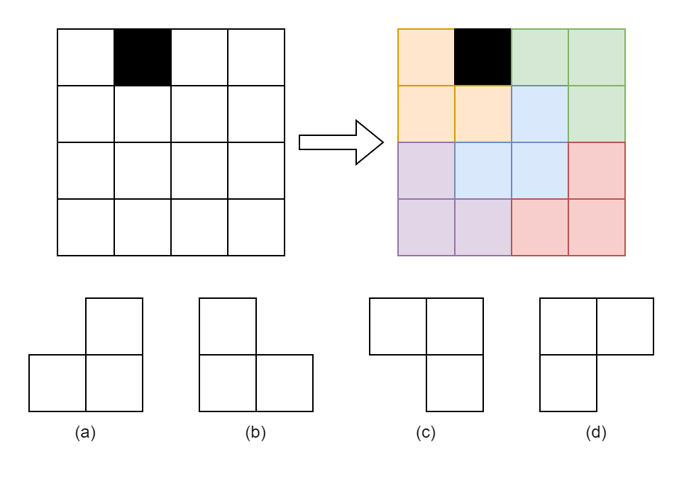

<title>实验三：分治</title>
<div style="text-align:center">
<p style="font-size: 48px;">算法设计与分析<p>
<p style="font-size: 24px; line-height: 0">实验三：分治</p>
</div>

## 1. 实验目的
以棋盘问题为例，掌握分治算法。

## 2. 实验内容
### 棋盘问题
在一个 $2^k \times 2^k$ 个方格组成的棋盘中，若恰有一个方格与其他方格不同，则称该方格为特殊方格。现用以下4种L型骨牌对其除特殊方格外进行不重叠覆盖，请给出覆盖方案。  
  

**输入样例**  
第一行k，表示棋盘大小为$2^k$。  
```
2
```
**输出样例**  
包含一个$2^k \times 2^k$的矩阵，为填充方案。  
```
2 0 3 3
2 2 1 3
4 1 1 5
4 4 5 5
```

### 算法分析
请尝试使用课堂中对整体时间复杂度进行假设并展开的方式，求时间复杂度。

## 3. 实验要求
请写出题目的思路、代码，并完成算法分析。
#### 提示：
在python中可以使用如下方式创建二维数组  
```python
mat = [[0 for j in range(n)] for i in range(n)]
```

## 4. 思考题
求 $a^b \bmod k$
1. 使用穷举法，并尝试使用分治法进行优化。
2. 使用不同的 $a$, $b$, $k$，比较算法时间上的区别。（ $a$, $b$, $k$ 需要取较大的值）
3. 分析算法的时间复杂度，寻找时间差距的原因。

#### 提示1：

```math
a^b \bmod k = (a \bmod k) ^ b \bmod k
```

```math
a^b \bmod k = 
\begin{cases}
    (a \cdot a)^{\frac{b}{2}} \bmod k & \text{if } b \bmod 2 == 0 \\
    \left( (a \cdot a)^{\frac{b-1}{2}} \cdot a \right) \bmod k & \text{if } b \bmod 2 == 1
\end{cases}
```

#### 提示2
在适当位置插入取余，防止溢出。
