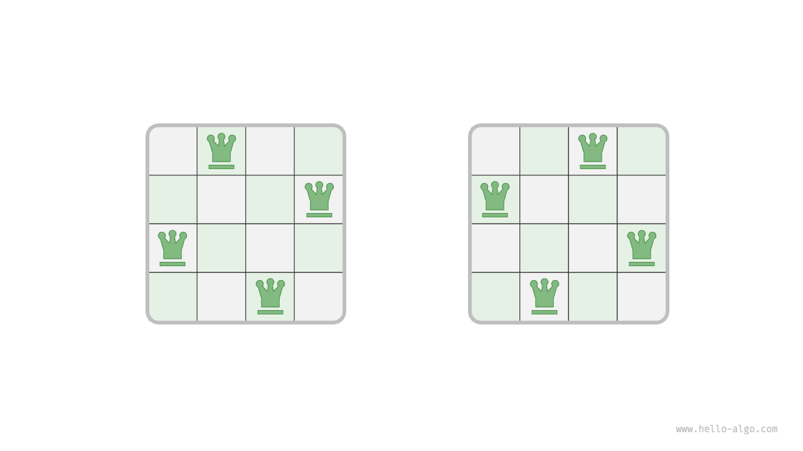

算法设计与分析

实验五：搜索与回溯

## 1. 实验目的
掌握搜索与回溯。

## 2. 实验内容
### 八皇后
根据国际象棋的规则，皇后可以攻击与同处一行、一列或一条斜线上的棋子。给定$n$个皇后和一个$n \times n$大小的棋盘，寻找使得所有皇后之间无法相互攻击的摆放方案。  

## 3. 实验要求
请写出题目的思路、代码。

## 思考题
把正整数 $n$ 分解为3个整数，要求后面的数大于等于前面的数。  
例如：$6 = 1 + 2 + 3$  
请尝试使用非递归方法完成上述问题。
