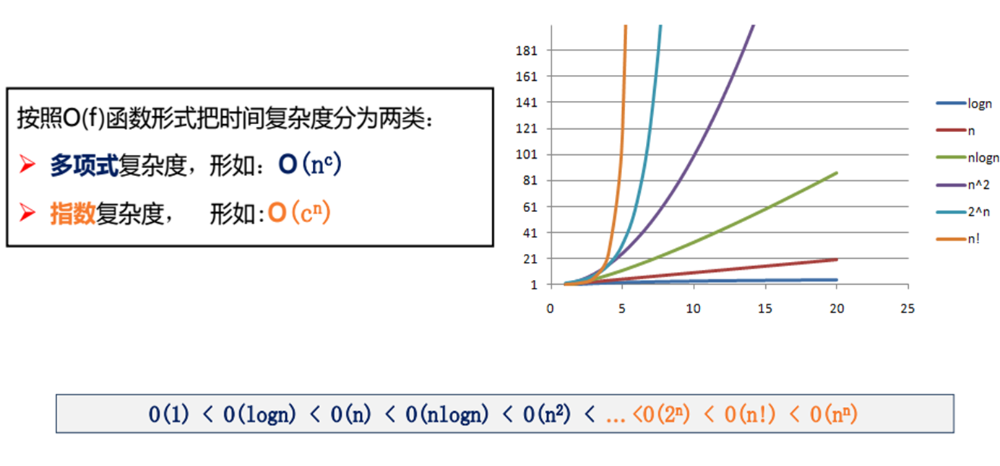

<!-- _class: title -->
# 复杂度

---

# 算法的伪码描述
赋值语句：←
分支语句：if ... then ... [ else ... ]
循环语句：while, for, repeat until 
转向语句：goto
输出语句：return
调用：直接写过程的名字
注释：//…

---

# 实例：求最大公约数
## `Euclid(m,n)`
输入：非负整数$m$、$n$，其中$m$与$n$不全为$0$
输出：$m$与$n$的最大公约数
```
while m>0 do
  r ← n mod m
  n ← m
  m ← r
return n
```

---

# 实例：改进的顺序检索
## `Search(L,x)`
输入：数组$L[1..n]$，其元素按照从小到大排列，数$x$
输出：若$x$在$L$中，输出$x$的位置下标$j$；否则输出$0$
```
j←1
while j≤n and x>L[j] do j←j+1
if x<L[j] or j>n then j←0
return j
```

---

# 基本运算与输入规模
- 算法时间复杂度：针对指定基本运算，算法所做运算次数
- 基本运算：比较，加法，乘法，置指针，交换...
- 输入规模：输入串编码长度
    - 通常用下述参数度量：数组元素多少，调 度问题的任务个数，图的顶点数与边数等
> 算法基本运算次数可表为输入规模的函数

---

# 输入规模
- 排序：数组中元素个数$n$
- 检索：被检索数组的元素个数$n$
- 整数乘法：两个整数的位数$m$，$n$
- 矩阵相乘：矩阵的行列数$i$，$j$，$k$
- 图的遍历：图的顶点数$n$，边数$m$
...

---

# 基本运算
- 排序：元素之间的比较
- 检索：被检索元素$x$与数组元素的比较
- 整数乘法：每位数字相乘（位乘）$1$次，$m$位和$n$位整数相乘要做$mn$次位乘
- 矩阵相乘：每对元素乘$1$次，$i \times j$矩阵与$j \times k$矩阵相乘要做$ijk$次乘法
- 图的遍历：置指针
...

---

# 算法的两种时间复杂度
对于相同输入规模的不同实例，算法的基本运算次数也不一样，可定义两种时间复杂度
- **最坏情况下的时间复杂度$W(n)$**
算法求解输入规模为$n$的实例所需要的最长时间
- **平均情况下的时间复杂度$A(n)$**
在给定同样规模为$n$的输入实例的概率分布下，算法求解这些实例所需要的平均时间

---

# $A(n)$计算公式
## 平均情况下的时间复杂度$A(n)$
设$S$是规模为$n$的实例集，实例$I \in S$的概率是$P_I$
算法对实例$I$执行的基本运算次数是$t_I$
$$
A(n)=\sum_{I \in S} P_It_I
$$
在某些情况下可以假定每个输入实例概率相等

---

# 例子：检索
输入：非降顺序排列的数组$L$,元素数$n$，数$x$
输出：$j$
若$x$在$L$中，$j$是$x$首次出现的下标；否则$j=0$
基本运算：$x$与$L$中元素的比较

---

# 例子：检索
```python
def search(L, x):
    for i in range(len(L)):
        if x==L[i]:
            return i
    return -1
```
若$L=[1,2,3,4,5]$
- $x=4$时，需要比较4次
- $x=2.5$时，需要比较5次

---

# 例子：检索 - 最坏情况

## 最坏情况
当$x$不在$L$中，或$x$为$L$的最后一个元素
最坏情况下时间：$W(n)=n$

---

# 例子：检索 - 平均情况
假设$x$在$L$中的概率是$p$，且每个位置概率相等
$$
\begin{aligned}
A(n) &= \sum^{n}_{i=1}i \frac{p}{n} + (1-p)n \\
     &= \frac{p(n+1)}{2}+(1-p)n
\end{aligned}
$$
当$p=\frac{1}{2}$时，
$$
A(n)=\frac{n+1}{4}+\frac{n}{2}
$$

---

# 函数的渐近的界
在实际算法的时间复杂度与空间复杂度分析中，我们通常会使用函数的渐近的界来进行表示。

---

# 大$O$符号(Big O Notation)
**定义**：设$f$和$g$是定义域为自然数集$\mathbb{N}$上的函数。若**存在**正数$c$和$n_0$，使得对一切$n \geq n_0$有
$$
0 \leq f(n) \leq cg(n)
$$
成立，则称$f(n)$的渐近的上界是$g(n)$，记作
$$
f(n)=O(g(n))
$$

---

# 大O符号 - 例子
设$f(n)=n^2+n$，则
$f(n)=O(n^2)$，取$c = 2$，$n0 =1$即可
$f(n)=O(n^3)$，取$c = 1$，$n0 =2$即可
1. $f(n)=O(g(n))$，$f(n)$的阶不高于$g(n)$的阶
2. 可能存在多个正数$c$，只要指出一个即可
3. 对前面有限个值可以不满足不等式
4. 常函数可以写作$O(1)$

---

# 函数的渐近的界 - 补充
除了大$O$符号，还有大$\Omega$符号，小$o$符号，小$\omega$符号，$\Theta$符号

---

# 常用的函数的渐近的界

