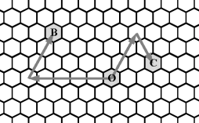

<!-- _class: title -->
# 模拟与穷举

---

# 什么是模拟法
模拟法就是根据题目的含义，使用计算机对题目中的操作进行一步一步地模拟。

---

# 模拟法解题的步骤
1. 根据题意，建立合适的数学模型
2. 根据建立的数学模型，按照题意，一步一步进行模拟操作

---

# 模拟法例题1
一只长度不计的蠕虫位于 $n$ 英寸深的井的底部。它每次向上爬 $u$ 英寸，但是必须休息一次才能再次向上爬。在休息的时候，它滑落了 $d$ 英寸。之后它将重复向上爬和休息的过程。蠕虫爬出井口需要至少爬多少次？如果蠕虫爬完后刚好到达井的顶部，我们也设作蠕虫已经爬出井口。[$^{[source]}$](https://www.dotcpp.com/oj/problem2685.html)
<div style="column-count: 2">
<div style="break-inside: avoid">

**Input 1**
```
5 0 15
```
**Output 1**
```
3
```

</div>

<div style="break-inside: avoid">

**Input 2**
```
3 1 4
```
**Output 2**
```
2
```

</div>
</div>

---

# 模拟法例题1 - 题解
```python
u, d, n = map(int, input().split())
time = dist = 0
while True:  # 用死循环来枚举
    dist += u
    time += 1
    if dist >= n:  # 满足条件则退出死循环
        break
    dist -= d
print(time)  # 输出得到的结果
```

---

<style scoped>
    p {
        font-size: 23px;
    }
</style>
# 模拟法例题2
蜂巢由大量的六边形拼接而成，定义蜂巢中的方向为：0表示正西方向，1表示西偏北 $60^\circ$，2表示东偏北 $60^\circ$，3表示正东，4表示东偏南 $60^\circ$，5表示西偏南 $60^\circ$。  
对于给定的一点 $O$，我们以 $O$ 为原点定义坐标系，如果一个点 $A$ 由 $O$ 点先向 $d$ 方向走 $p$ 步再向 $(d + 2) \% 6$ 方向（$d$ 的顺时针 $120^\circ$ 方向）走 $q$ 步到达，则这个点的坐标定义为 $(d, p, q)$。在蜂窝中，一个点的坐标可能有多种。  
下图给出了点 $B(0, 5, 3)$ 和点 $C(2, 3, 2)$ 的示意。
  
给定点 $(d1, p1, q1)$ 和点 $(d2, p2, q2)$，请问他们之间最少走多少步可以到达？[$^{[source]}$](https://www.dotcpp.com/oj/problem2685.html)

---

# 模拟法例题2 - 题解

<div style="display: grid; grid-template-columns: 3fr 7fr; gap: 1.5rem">

```python
def move(d, dis, x, y):
    if d == 0:
        x -= dis
    elif d == 1:
        x -= dis
        y += dis
    elif d == 2:
        y += dis
    elif d == 3:
        x += dis
    elif d == 4:
        x += dis
        y -= dis
    else:
        y -= dis
    return x, y
```

```python
d1, p1, q1, d2, p2, q2 = map(int, input().split())
x1 = y1 = x2 = y2 = 0
x1, y1 = move(d1, p1, x1, y1)
x1, y1 = move((d1+2) % 6, q1, x1, y1)
x2, y2 = move(d2, p2, x2, y2)
x2, y2 = move((d2+2) % 6, q2, x2, y2)
if (x1 > x2):
    x1, x2 = x2, x1
    y1, y2 = y2, y1
if (y1 >= y2):
    print(max(abs(x1-x2), abs(y1-y2)))
else:
    print(abs(x1-x2) + abs(y1-y2))
```

</div>

---

# 什么是穷举法
穷举法(Enumerate)是蛮力策略(Brute Force)的一种表现形式。它根据问题中的条件将可能的情况一一列举出来，逐一尝试从中找出满足问题条件的解。

---

# 穷举法解题的步骤
1. **找出解空间**
解空间即枚举范围，即所有有可能的情况。
2. **找出约束条件**
约束条件即满足问题的解的条件，当条件满足时，得到问题的解。
> **可选**
> - **减少枚举空间**
> 排除明显不满足条件的解
> - **选择合适的枚举顺序**
> 合适的枚举顺序可以减少运算的时间

---

# 穷举法例题1
公鸡一只5元，母鸡一只3元，小鸡3只1元。如何用100元买100只鸡。其中公鸡，母鸡，小鸡的数量各是多少？

---

# 穷举法例题1 - 题解
```python
for i in range(0, 101):
    for j in range(0, 101):
        for k in range(0, 301):
            if i + j + k == 100 and 5*i + 3*j + k/3 == 100:
                print(i, j, k)
```

---

# 穷举法例题1 - 题解
```python
for i in range(0, 101):
    for j in range(0, 101):
        for k in range(0, 301):
            if i + j + k == 100 and 5*i + 3*j + k/3 == 100:
                print(i, j, k)
```
<div style="font-size: 48px; text-align: center;">

时间复杂度 $O(n^3)$

</div>

---

# 穷举法例题1 - 优化1
```python
for i in range(0, 21):
    for j in range(0, 34):
        k = 100 - i - j
        if i + j + k == 100 and 5*i + 3*j + k/3 == 100:
            print(i, j, k)
```

---

# 穷举法例题1 - 优化1
```python
for i in range(0, 21):
    for j in range(0, 34):
        k = 100 - i - j
        if i + j + k == 100 and 5*i + 3*j + k/3 == 100:
            print(i, j, k)
```
<div style="font-size: 48px; text-align: center;">

时间复杂度 $O(n^2)$

</div>

---

# 穷举法例题1 - 优化2
```python
for _ in range(0, 6):
    i = 4*_
    j = 25-7*_
    k = 75+3*_
    if j >= 0:
        print(i, j, k)
```

---

# 穷举法例题2
已知正整数n是两个不同的质数的乘积，试求出两者中较大的那个质数。
**Input**
```
21
```
**Output**
```
7
```

---

# 穷举法例题2 - 题解
```python
x = int(input())
for i in range(2, x):
    if x % i == 0:
        print(x//i)
        break
```
