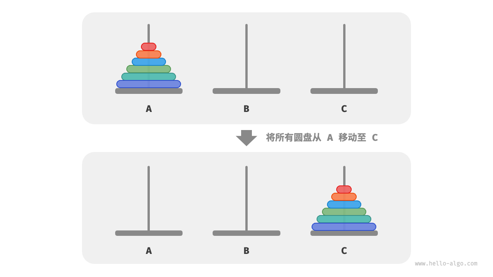

<!-- _class: title -->
# 递归

---

# 什么是递归
递归(Recursion)在数学或计算机中是指在函数中调用函数自身。
<div style="column-count: 2">


<br><br><br>

$$
\begin{align*}
    f(6) &= f(5)+6  \\
         &= f(4)+5+6  \\
         &= f(3)+4+5+6  \\
         &= f(2)+3+4+5+6  \\
         &= f(1)+2+3+4+5+6
\end{align*}
$$

</div>

---

# 例题1：求和
求 $[1,n]$ 的和。

---

# 例题1：求和 - 题解
> 求 $[1,n]$ 的和。

设 $f(n)$ 为 $[1,n]$ 的和。
...

<div style="text-align: center; font-size: 48px; color: blue;">

那么 $f(n-1)$ 是什么？

</div>

---

# 例题1：求和 - 题解
> 求 $[1,n]$ 的和。

设 $f(n)$ 为 $[1,n]$ 的和。  
则 $f(n-1)=f(n)-n$，  
因此 $f(n)=f(n-1)+n$。

---

# 例题1：求和 - 题解
> 求 $[1,n]$ 的和。

设 $f(n)$ 为 $[1,n]$ 的和。  
则 $f(n-1)=f(n)-n$，  
因此 $f(n)=f(n-1)+n$。

<div style="text-align: center; font-size: 48px; color: red;">
结束了吗？函数完整吗？
</div>

---

# 例题1：求和 - 题解

<div style="text-align: center; font-size: 48px;">

$$
f(n)=f(n-1)+n
$$

</div>
<br>

$$
\begin{align*}
    f(3) &= f(2)+3  \\
            &= f(1)+2+3  \\
            &= f(0)+1+2+3  \\
            &= \color{red}{f(-1)+0+1+2+3}  \\
            &= \color{red}{f(-2)+(-1)+0+1+2+3}
\end{align*}
$$

<div style="text-align: center; font-size: 48px; color: red;">
递归何时终止？
</div>

---

# 例题1：求和 - 题解
> 求 $[1,n]$ 的和。

设 $f(n)$ 为 $[1,n]$ 的和。  
则 $f(n-1)=f(n)-n$，  
因此 $f(n)=f(n-1)+n$。  
当 $n=1$ 时， $f(n)=f(1)=1$。  
因此可以写出函数：  

$$
f(n) =
\begin{cases}
    f(n-1)+n    & \text{if } n>1 \hspace{2em} \fbox{Recursive Case} \\
    1    & \text{if } n=1 \hspace{2em} \fbox{Base Case}
\end{cases}
$$

Recursive Case可以认为是递归的情形，可以翻译为**递归方程**。  
Base Case可以认为是基础的情形，可以翻译为**边界条件**。

---

# 递归的重要特征
**Recursive Case**和**Base Case**是递归的两个重要特征。

$$
f(n) =
\begin{cases}
    f(n-1)+n    & \text{if } n>1 \hspace{2em} \fbox{Recursive Case} \\
    1    & \text{if } n=1 \hspace{2em} \fbox{Base Case}
\end{cases}
$$

<div style="text-align: center; font-size: 48px; color: blue;">
请根据递归方程写出程序
</div>


---

# 例题1：求和 - 题解
```python
def f(n):
    if n == 1:
        return 1
    else:
        return f(n-1)+n
n = int(input())
print(f(n))
```

---

# 递归与递推的转化

$$
f(n) =
\begin{cases}
    f(n-1)+n    & \text{if } n>1 \hspace{2em} \fbox{Recursive Case} \\
    1    & \text{if } n=1 \hspace{2em} \fbox{Base Case}
\end{cases}
$$

由$f(1)$可以推出$f(2)$，由$f(2)$可以推出$f(3)$，...，由$f(n-1)$可以推出$f(n)$。
<div style="text-align: center; font-size: 48px; color: blue;">
递归：自顶向下<br>
递推：自底向上
</div>

---

# 例题1：求和 - 题解
```python
n = int(input())
s = 1
for i in range(2, n+1):
    s += i
print(s)
```

---

# 习题1：阶乘
请写出 $n!$ 的递归函数，并写出对应的代码。

---

# 例题2：斐波那契数列（实验题）

$$
f(n)=
\begin{cases}
    f(n-1)+f(n-2)    & n>2 \\
    1    & n=1,2
\end{cases}
$$
<div style="text-align: center; font-size: 48px; color: blue;">
请用递归和递推两种方法写出代码
</div>

---

# 例题2：斐波那契数列（实验题）

$$
f(n)=
\begin{cases}
    f(n-1)+f(n-2)    & n>2 \\
    1    & n=1,2
\end{cases}
$$

<br>
<div style="font-size: 36px; color: blue;">

根据写出的代码，思考以下问题：
1. 对比两个代码的效率。
2. 是什么导致了效率差距？
3. 能否进行优化？

</div>

---

<style scoped>
    p, li {
        font-size: 20px;
        margin-bottom: 5px;
    }
    ol {
        margin-top: 0px;
    }
</style>
# 例题3：汉诺塔问题
<br>

给定三根柱子，记为A、B和C。起始状态下，柱子A上套着n个圆盘，它们从上到下按照从小到大的顺序排列。我们的任务是要把这n个圆盘移到柱子C上，并保持它们的原有顺序不变。在移动圆盘的过程中，需要遵守以下规则。  
1. 圆盘只能从一根柱子顶部拿出，从另一根柱子顶部放入。  
2. 每次只能移动一个圆盘。  
3. 小圆盘必须时刻位于大圆盘之上。  



---

# 例题3：汉诺塔问题 - 题解
<br>

```python
def move(src: list[int], tar: list[int]):
    """移动一个圆盘"""
    # 从 src 顶部拿出一个圆盘
    pan = src.pop()
    # 将圆盘放入 tar 顶部
    tar.append(pan)
def dfs(i: int, src: list[int], buf: list[int], tar: list[int]):
    """求解汉诺塔问题 f(i)"""
    # 若 src 只剩下一个圆盘，则直接将其移到 tar
    if i == 1:
        move(src, tar)
        return
    # 子问题 f(i-1) ：将 src 顶部 i-1 个圆盘借助 tar 移到 buf
    dfs(i - 1, src, tar, buf)
    # 子问题 f(1) ：将 src 剩余一个圆盘移到 tar
    move(src, tar)
    # 子问题 f(i-1) ：将 buf 顶部 i-1 个圆盘借助 src 移到 tar
    dfs(i - 1, buf, src, tar)
def solve_hanota(A: list[int], B: list[int], C: list[int]):
    """求解汉诺塔问题"""
    n = len(A)
    # 将 A 顶部 n 个圆盘借助 B 移到 C
    dfs(n, A, B, C)
```
