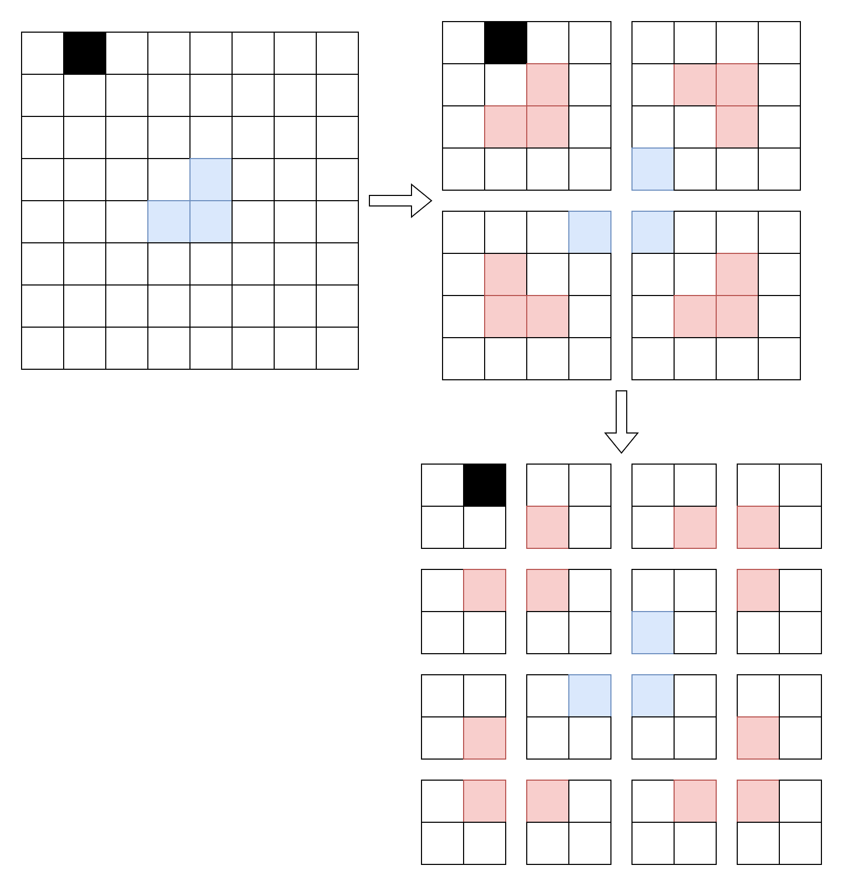

<!-- _class: title -->
# 分治

---

# 减治法
减治法(Decrease and Conquer)是分治法(Divide and Conquer)的一种特殊情况。  
减治法通过探寻问题中较大规模的解与较小规模的解之间的关系，不断减小问题的规模，进而通过解决小规模的问题来解决大规模的问题。

$$
\begin{align*}
    f(6) &= f(5)+6  \\
         &= f(4)+5+6  \\
         &= f(3)+4+5+6  \\
         &= f(2)+3+4+5+6  \\
         &= f(1)+2+3+4+5+6
\end{align*}
$$

$$
f(6) \rightarrow f(5) \rightarrow f(4) \rightarrow f(3) \rightarrow f(2) \rightarrow f(1)
$$

$$
f(n) \rightarrow f(n-1) \rightarrow f(n-2) \rightarrow ... \rightarrow f(2) \rightarrow f(1)
$$

---

# 减治法例题：二分查找
在有 $n$ 个元素的正序有序序列（数组）中，查找元素 $x$ 在元素中的位置。
<br><br>

<div style="font-size: 36px; color: blue;">

假设使用一个函数 $f(args[])$ 来解决这个问题，那么该函数需要包含哪些参数？

</div>

---

# 减治法例题：二分查找 - 题解
假设$f(arr, x, l ,r)$返回$x$在数组$arr[l, r]$中的位置。  
...
<br><br>


> $[l, r]$ 即是问题的规模  
> $arr, x$ 是函数需要知道的信息，即原始数组与待查找的值

---

# 减治法例题：二分查找 - 题解
假设 $f(arr, x, l, r)$ 返回 $x$ 在数组 $arr[l, r]$ 中的位置。  
令 $m=(l+r)//2$，则 $arr[m]$ 代表序列中间的元素。  
若 $arr[m]=x$，说明 $arr[m]$ 就是要找的元素，则$f(arr, x, l, r) = m$；  
若 $arr[m]<x$，说明 $x$ 只可能在 $arr[m]$ 的右侧，因此 $f(arr, x, l, r) = f(arr, x, m+1, r)$；  
若 $arr[m]>x$ ，说明 $x$ 只可能在 $arr[m]$ 的左侧，因此 $f(arr, x, l, r) = f(arr, x, l, m-1)$。  
<div style="text-align:center; font-size: 48px; color: blue;">
要是找不到呢？
</div>

---

# 减治法例题：二分查找 - 题解
假设 $f(arr, x, l, r)$ 返回 $x$ 在数组 $arr[l, r]$ 中的位置。  
若 $l<r$，说明没找到，则返回 $-1$ 。<span style="color: red;">&emsp;&emsp;注意判断位置</span>  
令 $m=(l+r)//2$，则 $arr[m]$ 代表序列中间的元素。  
若 $arr[m]=x$，说明 $arr[m]$ 就是要找的元素，则$f(arr, x, l, r) = m$；  
若 $arr[m]<x$，说明 $x$ 只可能在 $arr[m]$ 的右侧，因此 $f(arr, x, l, r) = f(arr, x, m+1, r)$；  
若 $arr[m]>x$ ，说明 $x$ 只可能在 $arr[m]$ 的左侧，因此 $f(arr, x, l, r) = f(arr, x, l, m-1)$。  
<div style="text-align:center; font-size: 36px; color: blue;">

最后问题会被简化为"$f(1)$"，即 $l<r$ 的情形。

</div>

---

# 减治法例题：二分查找 - 题解
```python
def dfs(nums, target, i, j):
    if i > j:
        return -1
    m = (i + j) // 2
    if nums[m] < target:
        return dfs(nums, target, m + 1, j)
    elif nums[m] > target:
        return dfs(nums, target, i, m - 1)
    else:
        return m
def binary_search(nums, target):
    n = len(nums)
    return dfs(nums, target, 0, n - 1)
```
<div style="text-align:center; font-size: 48px; color: blue;">
时间复杂度？
</div>

---

# 减治法例题：二分查找 - 时间复杂度
假设时间复杂度为 $T(n)$， $n$ 为问题规模。

$$
\begin{align*}
T(n) &= O(1)+T(\frac{n}{2})  \\
     &= O(1)+O(1)+T(\frac{n}{4})  \\
     &= O(1)+O(1)+O(1)+T(\frac{n}{8})  \\
     &= \underbrace{O(1)+O(1)+...+O(1)}_{k}+T(\frac{n}{2^k})
\end{align*}
$$

其中 $T(\frac{n}{2^k})=T(1)=O(1)$，则 $k=log_{2}n$。  
则 $T(n)=O(logn)$。

---

# 分治法
分治法（Divide and Conquer）的设计思想是将一个难以直接解决的大问题分解为若干个规模较小的相似问题，再一一进行解决。

---

# 分治法解决问题的步骤
使用分治法求解问题，通常将整个问题分解成若干个小问题，然后再分而治之。  
  
如果分解得到的子问题相对来说还太大，则可反复使用分治策略继续分解，直到产生出方便求解的子问题。 
   
必要时逐步合并这些子问题的解，从而得到问题的解。

---

# 分治法解决问题的步骤
1. **分解**
将问题分解为若干个规模较小，互相独立，与原问题形式相同的子问题。  
2. **解决**
若子问题规模较小而容易被解决则直接解决，否则再继续分解为更小的子问题，知道容易解决。  
3. **合并**
将已求解的各个子问题的解，逐步合并为原问题的解。  

<div style="text-align:center; font-size: 36px; color: blue;">
如果每次分解只产生一个子问题，分治就变成了减治
</div>

---

# 分治法例题：棋盘问题
在一个 $2^k \times 2^k$ 个方格组成的棋盘中，若恰有一个方格与其他方格不同，则称该方格为特殊方格。现用以下4种L型骨牌对其除特殊方格外进行不重叠覆盖，请给出覆盖方案。


---

# 分治法例题：棋盘问题 - 题解
<br>


<div style="text-align:center; font-size: 36px; color: blue;">

那么 $f()$ 应该怎么设计？

</div>

---

# 分治法例题：棋盘问题 - 题解
1. **棋盘当前的位置**  
可以用两对数字$(a,b)$，$(c,d)$表示左上角与右下角  
或者用一对数字$(a,b)$表示左上角，以及棋盘大小$s$表示  
2. **特殊方块的位置**  
可以用一对数字$(x,y)$表示  
3. **为了标记，还需要表示棋盘的二维数组**  
可以使用全局变量，或引用传递的$arr$  
4. **记录现在用的是第几块**  
可以使用全局变量，或引用传递的$cnt$

最后可以得出函数 $f(a,b,x,y,s)$， $(a,b)$ 表示棋盘位置的左上角， $(x,y)$ 表示特殊点的位置， $s$ 表示当前棋盘大小。


---

# 分治法例题：棋盘问题 - 题解
<br>

**四种情况**  
1\. 左上角
2\. 右上角
3\. 左下角
4\. 右下角
  
**每种情况包含两种情况**  
1\. 包含特殊块  
直接继续分治
2\. 不包含特殊块  
填充靠近中心的块，并将填充块作为特殊块继续分治
  
**终止条件**：$s==1$
