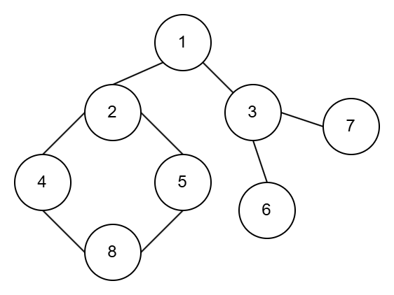
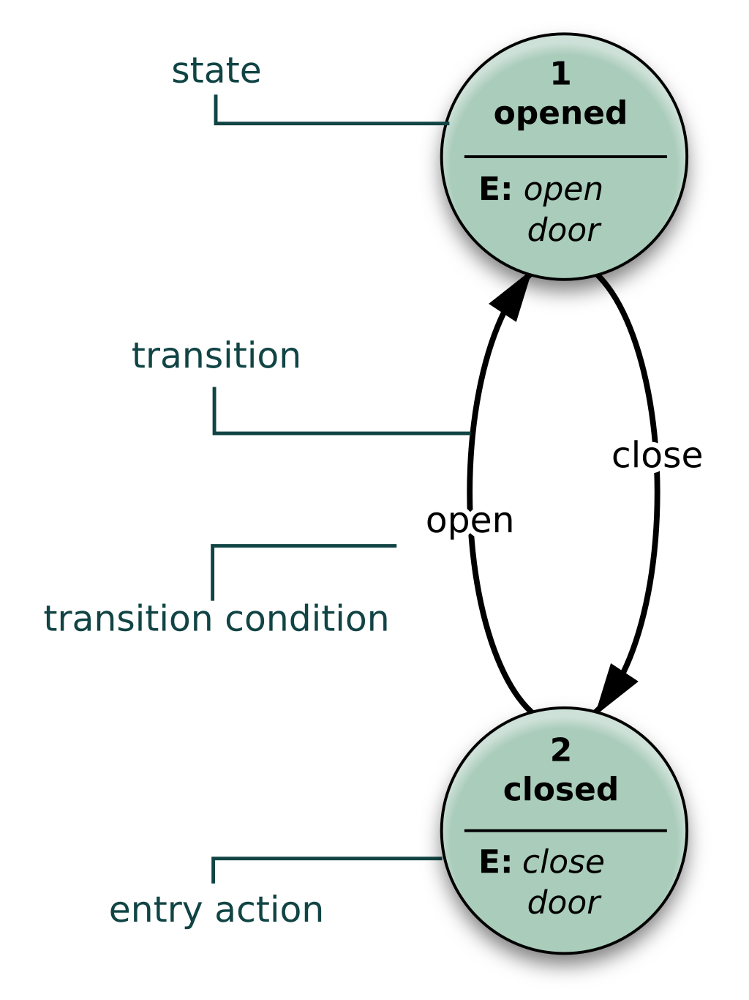
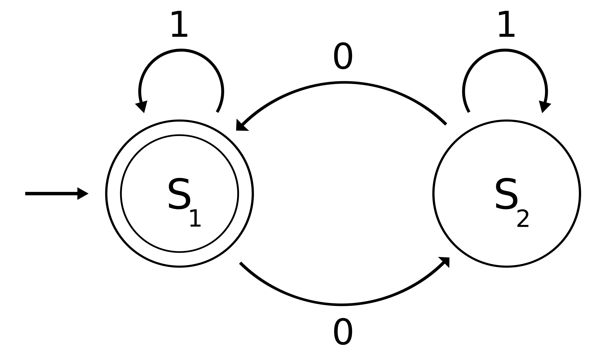
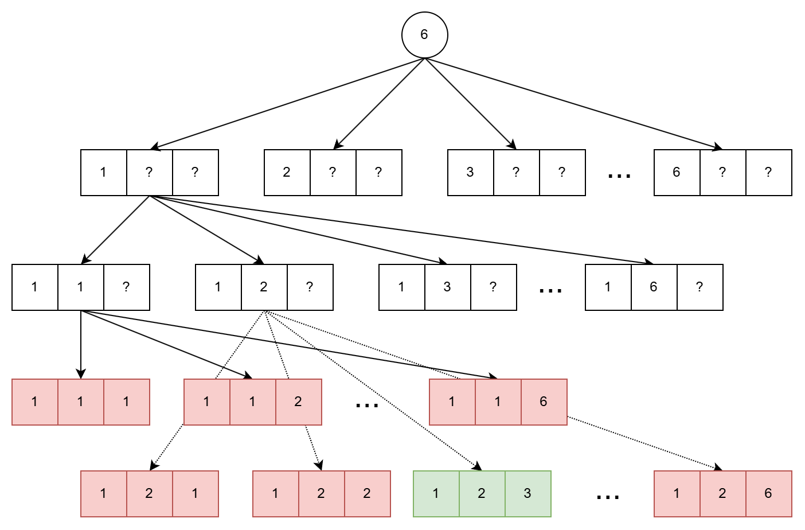
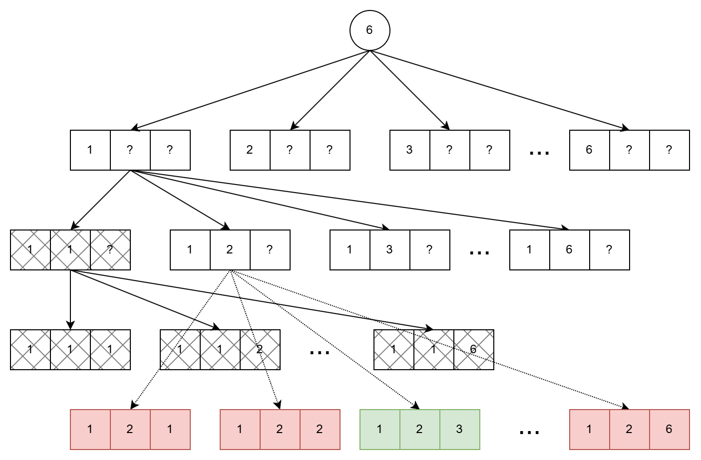
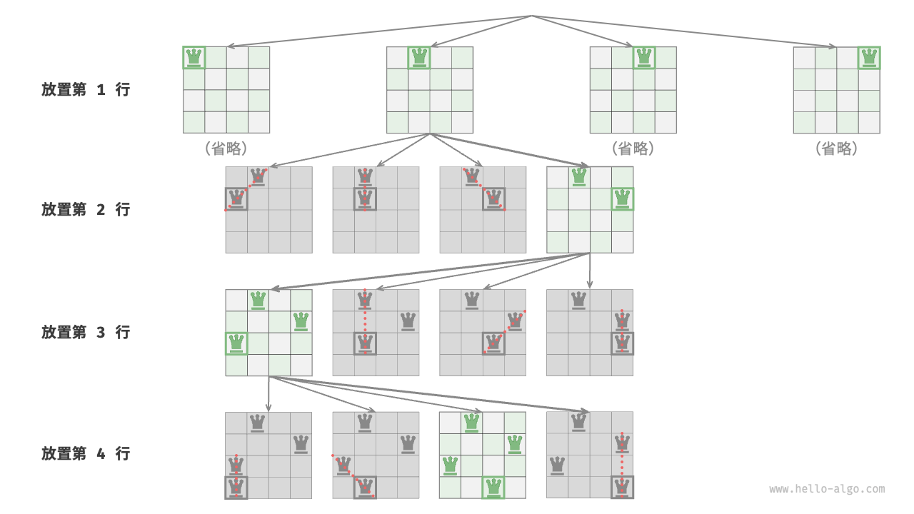

<!-- _class: title -->
# 搜索与回溯

---

# 回顾穷举法
1. **找出解空间**
解空间即枚举范围，即所有有可能的情况。
2. **找出约束条件**
约束条件即满足问题的解的条件，当条件满足时，得到问题的解。
> **可选**
> - **减少枚举空间**
> 排除明显不满足条件的解
> - **选择合适的枚举顺序**
> 合适的枚举顺序可以减少运算的时间

---

# 例题
把正整数n分解为3个整数，要求后面的数大于等于前面的数。  
例如：$6 = 1 + 2 + 3$
<div style="text-align:center; font-size: 48px; color: blue;">
如果是把正整数n分解为k个整数呢？
</div>

---

# 回顾图的搜索算法
图的搜索算法分为两种：
- 深度优先搜索(DFS)
每次尝试向更深的节点进行探索
- 广度优先搜索(BFS)
每次尝试访问同一层的节点

---

# 图的搜索算法例题
写出下图的DFS、BFS遍历的结果：  


---

# 图的搜索算法例题
写出下图的DFS、BFS遍历的结果：  

> DFS: 12485367  
> BFS: 12345678

---

# 有限状态机
**有限状态机**（finite-state machine，FSM）又称有限状态自动机，简称状态机，是表示有限个状态以及在这些状态之间的转移和动作等行为的数学计算模型。 [$^{source}$](https://zh.wikipedia.org/wiki/有限状态机)
<div style="column-count: 2">

  <br>

</div>

---

# 例题

对图进行深度优先搜索，即可完成对所有情况的处理。

---

# 例题

在搜索的过程中，明显不满足的分支可以被跳过。

---

# 例题 - 题解
```python
arr = [0] * 103  # arr 用于记录方案

def dfs(n, i, a):
    if n == 0 and i == m:
        print(arr[1:i])
    if i <= m:
        for j in range(a, n + 1):
            arr[i] = j
            dfs(n - j, i + 1, j)  # 请仔细思考该行含义。

# 主函数
n, m = map(int, input().split())
dfs(n, 1, 1)
```

---

# 回溯法
回溯法是一种组织搜索的一般技术，有“通用的解题法之称”，用它可以系统地搜索一个问题地所有解或任一解。  
回溯法通常适用于找到一个具有特定约束条件的问题的解或解集。  

---

# 回溯法的解题过程
回溯法在问题的解空间中，按深度优先策略，从根结点出发搜索解空间树。算法搜索至解空间树的任一结点时，先判断该结点是否包含问题的解。如果肯定不包含，则跳过继续按深度优先策略搜索。回溯法计算问题的所有解时，要回溯到根，且根结点的所有子树都已经被搜索完成才结束。

---

# 回溯法的术语
- **活结点**：如果已生成一个结点而它的所有儿子结点还没有全部生成，则这个结点叫作活结点。
- **扩展结点**：当前正在生成其儿子结点的活结点叫作扩展结点。（正扩展的结点）
- **死结点**：不再进一步扩展或者其儿子结点已全部生成的结点就是死结点。

---

# N皇后
根据国际象棋的规则，皇后可以攻击与同处一行、一列或一条斜线上的棋子。给定$n$个皇后和一个$n \times n$大小的棋盘，寻找使得所有皇后之间无法相互攻击的摆放方案。 [$^{source}$](https://www.hello-algo.com/chapter\_backtracking/n\_queens\_problem/)


---

# N皇后

