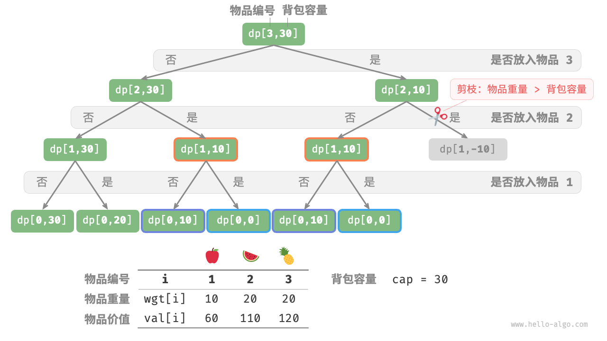
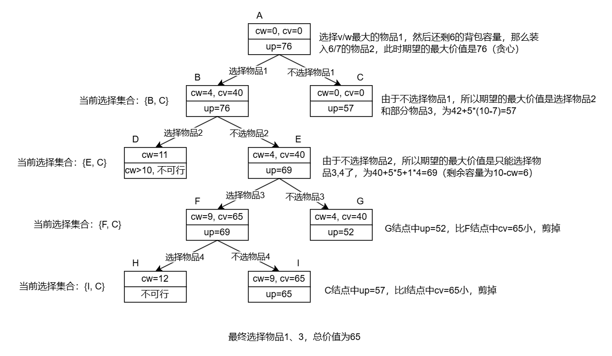

<!-- _class: title -->
# 动态规划

---

# 动态规划
动态规划(Dynamic Programming)通常用于求解具有某种最优性质的问题。其本质和记忆化搜索是相同的。

---

# 动态规划的基本要素
动态规划有如下基本要素：
- 最优子结构性质
问题的最优解包含其子问题的最优解。
- 子问题重叠性质
在求解子问题的过程中，每次产生的子问题并不总是新问题，有些子问题重复出现，这种性质被称为子问题重叠性质。（对于这类问题我们通常会将其结果保存下来，这就是记忆）

---

# 动态规划的解题步骤
动态规划的解题步骤如下：
1. 分析最优子结构性质
2. 递归地定义最优值
3. 以自底向上的方式计算出最优值
4. 根据计算最优值时得到的信息，构造最优解

---

# 例题1：爬楼梯问题
给定一个共有n阶的楼梯，你每步可以上1阶或者2阶，请问有多少种方案可以爬到楼顶？

---

# 例题1：爬楼梯问题 - 题解
本质就是斐波那契数列。

---

# 例题：01背包问题
给定 $n$ 个物品，第 $i$ 个物品的重量为 $W_i$、价值为 $V_i$，和一个容量为 $C$ 的背包。每个物品只能选择一次，问在限定背包容量下能放入物品的最大价值。
<div style="display: flex; justify-content: center;">

| 编号 |  重量 | 价值 |
|:----:|:----:|:----:|
|  1  |   4   |  40  |
|  2  |   5   |  25  |
|  3  |   3   |  12  |
|  4  |   7   |  42  |
</div>

---

# 例题：01背包问题
给定 $n$ 个物品，第 $i$ 个物品的重量为 $W_i$、价值为 $V_i$，和一个容量为 $C$ 的背包。每个物品只能选择一次，问在限定背包容量下能放入物品的最大价值。
<div style="display: flex; justify-content: center;">

| 编号 |  重量 | 价值 | V/W |
|:----:|:----:|:----:|:---:|
|  1  |   4   |  40  |  10 |
|  2  |   5   |  25  |  6  |
|  3  |   3   |  12  |  5  |
|  4  |   7   |  42  |  4  |
</div>

---

# 例题：01背包问题 - 暴力搜索
每个物品可以选，或者不选。  <br>


---

# 例题：01背包问题 - 暴力搜索
```python
def knapsack_dfs(wgt: list[int], val: list[int], i: int, c: int) -> int:
    """0-1 背包：暴力搜索"""
    # 若已选完所有物品或背包无剩余容量，则返回价值 0
    if i == 0 or c == 0:
        return 0
    # 若超过背包容量，则只能选择不放入背包
    if wgt[i - 1] > c:
        return knapsack_dfs(wgt, val, i - 1, c)
    # 计算不放入和放入物品 i 的最大价值
    no = knapsack_dfs(wgt, val, i - 1, c)
    yes = knapsack_dfs(wgt, val, i - 1, c - wgt[i - 1]) + val[i - 1]
    # 返回两种方案中价值更大的那一个
    return max(no, yes)
```

---

# 例题：01背包问题 - 记忆化搜索
```python
def knapsack_dfs_mem(
    wgt: list[int], val: list[int], mem: list[list[int]], i: int, c: int
) -> int:
    """0-1 背包：记忆化搜索"""
    # 若已选完所有物品或背包无剩余容量，则返回价值 0
    if i == 0 or c == 0:
        return 0
    # 若已有记录，则直接返回
    if mem[i][c] != -1:
        return mem[i][c]
    # 若超过背包容量，则只能选择不放入背包
    if wgt[i - 1] > c:
        return knapsack_dfs_mem(wgt, val, mem, i - 1, c)
    # 计算不放入和放入物品 i 的最大价值
    no = knapsack_dfs_mem(wgt, val, mem, i - 1, c)
    yes = knapsack_dfs_mem(wgt, val, mem, i - 1, c - wgt[i - 1]) + val[i - 1]
    # 记录并返回两种方案中价值更大的那一个
    mem[i][c] = max(no, yes)
    return mem[i][c]
```

---

# 例题：01背包问题 - 动态规划
```python
def knapsack_dp(wgt: list[int], val: list[int], cap: int) -> int:
    """0-1 背包：动态规划"""
    n = len(wgt)
    # 初始化 dp 表
    dp = [[0] * (cap + 1) for _ in range(n + 1)]
    # 状态转移
    for i in range(1, n + 1):
        for c in range(1, cap + 1):
            if wgt[i - 1] > c:
                # 若超过背包容量，则不选物品 i
                dp[i][c] = dp[i - 1][c]
            else:
                # 不选和选物品 i 这两种方案的较大值
                dp[i][c] = max(dp[i - 1][c], dp[i - 1][c - wgt[i - 1]] + val[i - 1])
    return dp[n][cap]
```

---

# 例题：01背包问题 - 分支限界法
<br>

如果给搜索一个方向？


---

# 习题：最长上升子序列
给定一个无序的整数数组，找到其中最长上升子序列的长度。

---

# 习题：最长上升子序列 - 题解
```python
class Solution:
    def lengthOfLIS(self, nums: List[int]) -> int:
      Len = len(nums)
      if Len == 0:
        return 0
      dp = [1] * Len  # 子序列的最短长度是1
      for i in range(Len):
        for j in range(i):
          if nums[j] < nums[i]:
            dp[i] = max(dp[i], dp[j]+1)
      maxLen = 1
      for i in range(Len):
         if dp[i] > maxLen:
           maxLen = dp[i]
      return maxLen
```
